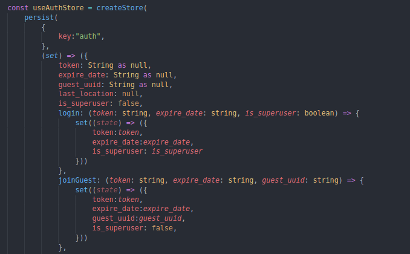
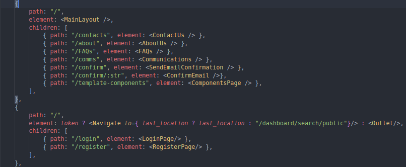

Template from https://demos.creative-tim.com/material-kit-react/#/?ref=mkr-readme

Our frontend was developed using React JS on top of JavaScript and Typescript.

Javascript was used across the entire frontend whereas the Typescript was used mainly on the World related pages and Stores using zustand and zustand-persist.

Zustand is a node library that allows react to store state within a session and Zustand-persist as the name suggests, persists. This persistance occurs in case the website is reloaded, which was particularly useful for application-level scope state since localstorage can be manipulated easily allowing users to act in unwanted ways and also because, if using Zustand, if a user refreshes the page the state would be lost and would have to log back in.




When it comes to routing, we used the react-router-dom library with special emphasys on the useRoutes function offered that was used to managed, in collaboration with the previously mentioned Zustand-persist, who could and could not access each endpoint of the application.




## How to run locally:

To run locally execute the following commands inside the `frontend/` directory:

```
$ npm install
$ npm start
```