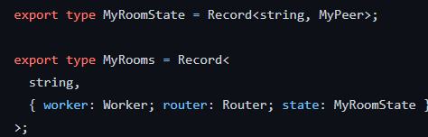
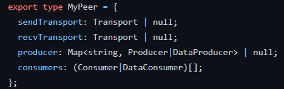
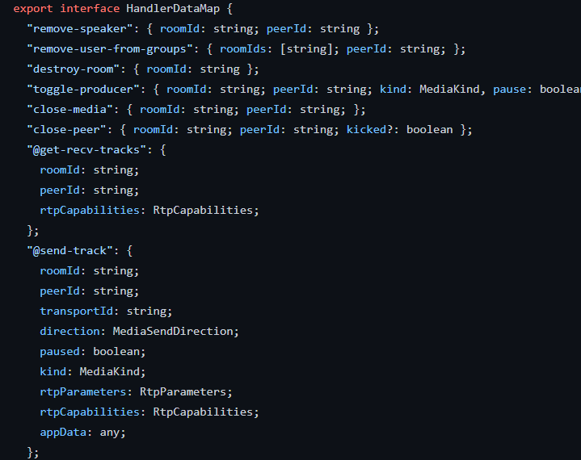
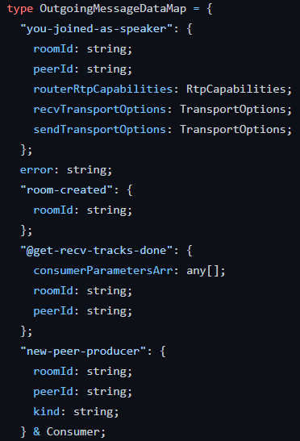

## Overview

[Mediasoup](https://mediasoup.org/) has an SFU (Selective Forwarding Unit) topology, where the server routes media around between participants while balancing its limitations with the media inputs it receives. With this approach, participants send their media to the server and receive others' media in separate streams, one each.

For more details of how mediasoup works and how we interacted with it within the browser, check out their documentation:

 - [Server Side Library](https://mediasoup.org/documentation/v3/mediasoup/api/)
 - [Client Side Library](https://mediasoup.org/documentation/v3/mediasoup-client/api/)

## Data Structures

For the Data Structures, we store the rooms associated with the media server, and each room has a [Worker](https://mediasoup.org/documentation/v3/mediasoup/api/#Worker), a [Router](https://mediasoup.org/documentation/v3/mediasoup/api/#Router) and a state associated.

A state has [Transports](https://mediasoup.org/documentation/v3/mediasoup/api/#Transport) associated as well as a map [Producers](https://mediasoup.org/documentation/v3/mediasoup/api/#Producer) for each type (video and audio) and a list of [Consumers](https://mediasoup.org/documentation/v3/mediasoup/api/#Consumer) of those Producers.

## Operations

In the `media_server/src/utils/startRabbit` directory it is possible to see the operations that are handled by the media server using typescript definitions:

And also what's returned at those operations:

## How to run locally:

Execute inside the `media_server/` directory:

- `npm i`
- `npm run build`
- `npm start`

Edit the `src/config.js` file according to your needs and create an `.env` file accordingly to the `.env.example`.
